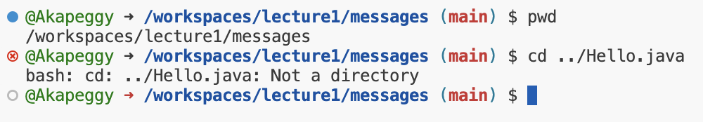
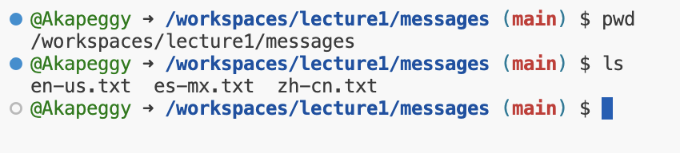
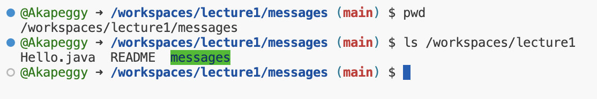
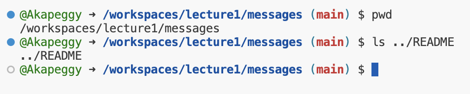
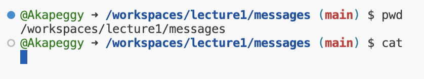
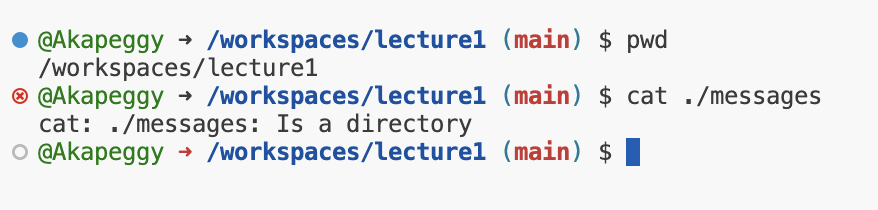
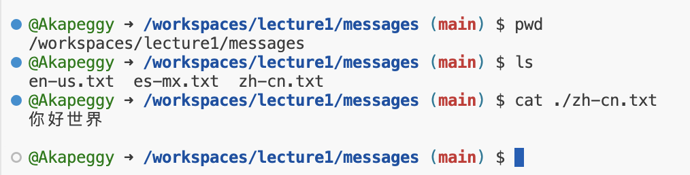

# **Lab 1 Report**
---   

## **1.1 Using the command 'cd' with no arguments**

* The absolute path to the working directory was '/workspaces/lecture1' right before the command 'cd' was run.
* It seems that using 'cd' without any arguments took me back to the home directory, `~`. It's a convenient way to return to the original directory within the file system.
* The output is not an error.
## **1.2 Using the command 'cd' with a path to a directory as an argument**

* The absolute path to the working directory was '/home/codespace' right before the command 'cd' was run.
* By inputting "/workspaces/lecture1/messages" as the path with the utilization of the command 'cd', my working directory was successfully changed to the indicated
    one by the filesystem.  
* The output is not an error.
## **1.3 Using the command 'cd' with a path to a file as an argument**

* The absolute path to the working directory was '/workspaces/lecture1/messages' right before the command 'cd' was run.
* I got the output that said `bash: cd: ../Hello.java: Not a directory` since after the relative path `../Hello.java` was joined and resolved to my working directory by the filesystem, it
* found that I'm tring to change my directory to a file with the command `cd`, which is within the function `cd` was designed to work as.
* The output is an error since the command 'cd' is designed to work as changing the current directory to another directory other than a file.
## **2.1 Using the command 'ls' with no arguments**

* The absolute path to the working directory was '/workspaces/lecture1/messages' right before the command 'ls' was run.
* I got this output since the command `ls` without argument lists out the files and folders under my current working directory as expected. This is exactly what `ls` without argument is supposed to output.
* The output is not an error.
## **2.2 Using the command 'ls' with a path to a directory as an argument**

* The absolute path to the working directory was '/workspaces/lecture1/messages' right before the command 'ls' was run.
* The output shows the list of files and folders under the '/workspaces/lecture1' directory as expected since this is the default function of the command 'ls'.
* The output is not an error.
## **2.3 Using the command 'ls' with a path to a file as an argument**

* The absolute path to the working directory was '/workspaces/lecture1/messages' right before the command 'ls' was run.
* I got the output showing the same as my input argument since there are no sub-files or folders in the given path that can be listed.
* The output is an error since the command 'ls' is to show the list of files and folders under a directory indicated by the path on the command line that follows `ls`, instead of an indicated file.
## **3.1 Using the command 'cat' with no arguments**

* The absolute path to the working directory was '/workspaces/lecture1/messages' right before the command 'cat' was run.
* It waits for my input when I use 'cat' with no argument since the command 'cat' needs a valid argument to do its job; otherwise, the system will not stop until 'ctrl+c' is entered.
* The output is an error. The command 'cat' needs to be followed by paths to do its work.
## **3.2 Using the command 'cat' with a path to a directory as an argument**

* The absolute path to the working directory was '/workspaces/lecture1' right before the command 'cat' was run.
* I got this output indicating that `cat: ./messages: Is a directory` since the path leads to a directory, not a file. The command `cat` needs to be followed by a path to a file to do its work.
* The output is an error. The command 'cat' works as displaying the context of the text files instead of a directory.
## **3.3 Using the command 'cat' with a path to a file as an argument**

* The absolute path to the working directory was '/workspaces/lecture1/messages' right before the command 'cat' was run.
* I got this output because the command 'cat' followed by a path to a file as an argument displays the content of that file, which implies the successfulness of the operation.
* The output is not an error.     

---
