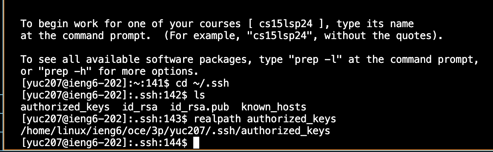

# **Lab Report 2**
---
* ## **Part 1**
  * Code for my ChatServer:

```
import java.io.IOException;
import java.net.URI;


class ChatHandler implements URLHandler {
  String chatHistory = "";

  public String handleRequest(URI url) {

    if (url.getPath().equals("/")) {
      return chatHistory;
    }
    // expect /add-message?s=<message>&user=<name>
    else if (url.getPath().equals("/add-message")) {
      String[] params = url.getQuery().split("&");
      String[] shouldBeMessage = params[0].split("=");
      String[] shouldBeUser = params[1].split("=");
      if (shouldBeMessage[0].equals("s") && shouldBeUser[0].equals("user")) {
        String user = shouldBeUser[1];
        String message = shouldBeMessage[1];
        this.chatHistory += user + ": " + message + "\n";
        return this.chatHistory;
      } 
      else {
        return "Invalid parameters";
      }
    }
    

    return "404 Not Found";
  }
}

class ChatServer {
  public static void main(String[] args) throws IOException {
    int port = Integer.parseInt(args[0]);
    Server.start(port, new ChatHandler());
  }
}


```
  * First screenshot using `/add-message`:
  
    1.   Which methods in your code are called?
         The `main` method in the `class ChatServer` is first called when the Java program runs. It checks if the valid port number is inputted from the command line argument. If so, it will start the server
         and pass an object of ChatHandler as an argument into the `Server.start` method, and then the method `handleRequest` is called to handle the request of the URL, implements its functions and print a string
         to the web screen.    
    2.   What are the relevant arguments to those methods, and the values of any relevant fields of the class?   
         The relevant arguments to
           * the `main` method: args. This is the array of command-line arguments passed to the main method.
           * the `Server.start` method: port, and an object of type ChatHandler.
           * the `handleRequest` method: url. This is the URI representing the incoming request.
         The values of any relevant fields of the class:
           * `class ChatServer`: the value of `port` is 0 by default.
           * `class ChatHandler`: the value of `chatHistory` is ""
    3.   How do the values of any relevant fields of the class change from this specific request? If no values got changed, explain why.
           * `class ChatServer`: the value of `port` changes to 8000.
           * `class ChatHandler`: the value of `chatHistory` changes to "tracy: bye\n"
   
  * Second screenshot using `/add-message`;
  
    1.   Which methods in your code are called?
         The `main` method in the `class ChatServer` is first called when the Java program runs. It checks if the valid port number is inputted from the command line argument. If so, it will start the server
         and pass an object of ChatHandler as an argument into the `Server.start` method. Then, the method `handleRequest` is called to handle the request of the URL, implements its functions and print a string
         to the web screen.           
    2.   What are the relevant arguments to those methods, and the values of any relevant fields of the class?
         The relevant argument to
           * the `main` method: args. This is the array of command-line arguments passed to the main method.
           * the `Server.start` method: port, and an object of type ChatHandler.
           * the `handleRequest` method: url. This is the URI representing the incoming request.
         The values of any relevant fields of the class:
           * `class ChatServer`: the value of `port` is 8000.
           * `class ChatHandler`: the value of `chatHistory` is "tracy: bye\n"
    3.   How do the values of any relevant fields of the class change from this specific request? If no values got changed, explain why.
           * `class ChatServer`: the value of `port` does not change, since the main method is called once, and upon the server started, the value of port number remains the same as long as the server is running.
           * `class ChatHandler`: the value of `chatHistory` changes to "tracy: bye\npeggy: byebye\n"
  
---
* ## **Part 2**
  * Screenshot for the absolute path to the private key for your `SSH` key for logging into `ieng6` on my computer:
  
    
  * The absolute path to the public key for your `SSH` key for logging into `ieng6` on `ieng6` filesystem:
  
    
  * A terminal interaction where you log into your ieng6 account without being asked for a password:
  
    
---
* ## **Part 3**
  * In a couple of sentences, describe something you learned from the lab in week 2 or 3 that you didn't know before.  
     - I've learned a lot from the lab in week 2 and 3 that I didn't know before. I've learned how to set up my own web server by writing my own handler classes along with the given server.java. I also learned how to access a remote machine
    by using ssh and how to load and transfer files from local to remote by using curl and scp. I've learned how to set up my public and private keys for logging on remote devices without having to type my password each time as well.
