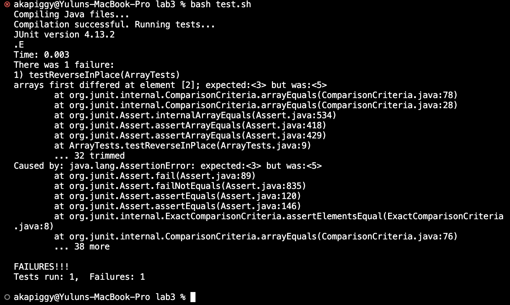

# **Lab 3 Report**
* ## **Part 1**
  * This is my buggy program for this lab
  ```
  public class ArrayExamps{
    // Averages the numbers in the array (takes the mean), but leaves out the
    // lowest number when calculating. Returns 0 if there are no elements or just
    // 1 element in the array
    static double averageWithoutLowest(double[] arr) {
      if(arr.length < 2) { return 0.0; }
      double lowest = arr[0];
      for(double num: arr) {
        if(num < lowest) { lowest = num; }
      }
      double sum = 0;
      for(double num: arr) {
        if(num != lowest) { sum += num; }
      }
      return sum / (arr.length - 1);
    }
  }
  ```
       
  * A failure-inducing input for the buggy program, as a JUnit test and any associated code
       
  ```
  import static org.junit.Assert.*;
  import org.junit.*;

  public class ArrayTests{
    @Test
    public void testAverageWithoutLowest(){
      double[] input1 = {1.0,1.0,2.0,2.0,3.0,5.0,5.0};
      assertEquals(3.0, ArrayExamples.averageWithoutLowest(input1), 0);
    }
  ```
       
  * An input that doesn't induce a failure, as a JUnit test and any associated code
       
  ```
    @Test
    public void testAssendingArr(){
      double[] input2 = {1.0, 2.0, 3.0, 4.0};
      assertEquals(3.0, ArrayExamples.averageWithoutLowest(input2), 0);
    }
  }
  ```
       
  * The symptom, as the output of running the tests
  
  * The bug, as the before-and-after code change required to fix it
    - Before:
      ```
      public class ArrayExamps {
        // Averages the numbers in the array (takes the mean), but leaves out the
        // lowest number when calculating. Returns 0 if there are no elements or just
        // 1 element in the array
        static double averageWithoutLowest(double[] arr) {
          if(arr.length < 2) { return 0.0; }
          double lowest = arr[0];
          for(double num: arr) {
            if(num < lowest) { lowest = num; }
          }
          double sum = 0;
          for(double num: arr) {
            if(num != lowest) { sum += num; }
          }
          return sum / (arr.length - 1);
        }
      }
      ```
    - After:
      ```
      public class ArrayExamps {
        // Averages the numbers in the array (takes the mean), but leaves out the
        // lowest number when calculating. Returns 0 if there are no elements or just
        // 1 element in the array
        static double averageWithoutLowest(double[] arr) {
          if(arr.length < 2) { return 0.0; }
          double lowest = arr[0];
          for(double num: arr) {
            if(num < lowest) { lowest = num; }
          }
          double sum = 0;
          for(double num: arr) {
            sum += num;
          }
          sum -= lowest;
          return sum / (arr.length - 1);
        }
      }
      ```
  * Briefly describe why the fix addresses the issue.
    * The bug in the buggy program appears in the logic of finding the lowest number in the array.
      This loop iterates through each element of the array and updates the lowest variable if the current number is less than the lowest.
      However, when calculating the average later, the code removes all occurrences of the lowest number, which could result in incorrect calculating of sum if there are duplicate lowest numbers in the array.
      By fixing the bug in this way, it can be ensured that only one single lowest number is skipped if there are duplicate lowest numbers,
      and the calculation of the average is based on the sum and number of the remaining elements correctly.
---
* ## **Part 2**
  ### **The command I choose: `find`**
  ### **Options:**
    ---
    1. `$ find <path> -iname "pattern"`
       * Source: [source_iname](https://docs.rackspace.com/docs/use-find-and-locate-to-search-for-files-in-linux#find-by-name))
       * This option of the command `find` is useful since many times we may not remember the exact name of the file we want to search for. It helps find files with approxiamate name as a pattern with case insensitive.
       * Example 1:
         ```
         akapiggy@Yuluns-MacBook-Pro technical % find . -iname "*redact*"
         ./government/Post_Rate_Comm/Redacted_Study.txt
         akapiggy@Yuluns-MacBook-Pro technical % 
         ```
         The -iname option finds the file name in pattern of "redact" under the current directory `technical/`, and output the absolute path to it.
       * Example 2:
         ```
         akapiggy@Yuluns-MacBook-Pro technical % find . -iname "*recom*"
         ./government/Alcohol_Problems/DraftRecom-PDF.txt
         akapiggy@Yuluns-MacBook-Pro technical % 
         ```
         The -iname option finds the file name in pattern of "recom" under the current directory `technical/`, and output the absolute path to it.
    ---
    2. `$ find <path> -type "type"`
       * Source: [source_type](https://man7.org/linux/man-pages/man1/find.1.html)
       * The option `-type` is useful for it can display files, directories, symlinks, named pipes, sockets, and more depends on the type we entered.
       * Example 1:
          ```
          akapiggy@Yuluns-MacBook-Pro technical % find . -type d
          .
          ./government
          ./government/About_LSC
          ./government/Env_Prot_Agen
          ./government/Alcohol_Problems
          ./government/Gen_Account_Office
          ./government/Post_Rate_Comm
          ./government/Media
          ./plos
          ./biomed
          ./911report
          akapiggy@Yuluns-MacBook-Pro technical % 
          ```
          The -type d shows all the directories under the current directory `technical/`.
       * Example 2:
         ```
         akapiggy@Yuluns-MacBook-Pro 911report % find ./911report -type f
         ./chapter-13.4.txt
         ./chapter-13.5.txt
         ./chapter-13.1.txt
         ./chapter-13.2.txt
         ./chapter-13.3.txt
         ./chapter-3.txt
         ./chapter-2.txt
         ./chapter-1.txt
         ./chapter-5.txt
         ./chapter-6.txt
         ./chapter-7.txt
         ./chapter-9.txt
         ./chapter-8.txt
         ./preface.txt
         ./chapter-12.txt
         ./chapter-10.txt
         ./chapter-11.txt
         akapiggy@Yuluns-MacBook-Pro 911report % 
         ```
         The -type f shows all the files under the relative path `./911report` under the current directory `technical/`.
    ---
    3. `$ find <path> -size "size or range"`
       * Source: [source_size](https://linuxhandbook.com/find-command-examples/)
       * The option `-size` can help find big files or small files based on the search performed by the size parameter. This only works with files, not directories.
       * Example 1:
         ```
         akapiggy@Yuluns-MacBook-Pro technical % find . -size +150k
         ./government/About_LSC/commission_report.txt
         ./government/Env_Prot_Agen/multi102902.txt
         ./government/Env_Prot_Agen/bill.txt
         ./government/Env_Prot_Agen/tech_adden.txt
         ./government/Gen_Account_Office/GovernmentAuditingStandards_yb2002ed.txt
         ./government/Gen_Account_Office/Statements_Feb28-1997_volume.txt
         ./government/Gen_Account_Office/pe1019.txt
         ./government/Gen_Account_Office/d01591sp.txt
         ./911report/chapter-13.4.txt
         ./911report/chapter-13.5.txt
         ./911report/chapter-3.txt
         akapiggy@Yuluns-MacBook-Pro technical %  
         ```
         The option `-size + 150k` shows all the files bigger than 150k in the current directory `technical/`.
       * Example 2:
         ```
         akapiggy@Yuluns-MacBook-Pro technical % find . -size +60k -size -65k
         ./government/Env_Prot_Agen/jeffordslieberm.txt
         ./government/Gen_Account_Office/Sept14-2002_d011070.txt
         ./government/Gen_Account_Office/Testimony_Jul17-2002_d02957t.txt
         ./biomed/gb-2003-4-4-r26.txt
         ./biomed/gb-2003-4-7-r42.txt
         ./biomed/gb-2003-4-7-r43.txt
         ./biomed/1471-2121-3-15.txt
         ./biomed/1472-6904-3-1.txt
         ./biomed/1475-4924-1-10.txt
         akapiggy@Yuluns-MacBook-Pro technical % 
         ```
         The option `-size +60k -size -65k` shows all the files bigger than 60k and smaller than 65k in the current directory `technical/`.
    ---
    4. `$ find <path> -maxdepth "levels"` or `$ find <path> -mindepth "levels"`
       * Source: [source_max/mindepth](https://www.computerhope.com/unix/ufind.htm)
       * Suppose we have multiple layers of nested subdirectories in a path. The option `-maxdepth` and `-mindepth` are useful for it allows us to specify the levels of directories as we want.
       * Example 1:
         ```
         akapiggy@Yuluns-MacBook-Pro technical % find . -maxdepth 1
         .
         ./government
         ./plos
         ./biomed
         ./911report
         akapiggy@Yuluns-MacBook-Pro technical %
         ```
         The option `-maxdepth 1` shows all the files with level 1 in the current directory `technical/`.
       * Example 2:
         ```
         akapiggy@Yuluns-MacBook-Pro technical % find ./911report -mindepth 1
         ./911report/chapter-13.4.txt
         ./911report/chapter-13.5.txt
         ./911report/chapter-13.1.txt
         ./911report/chapter-13.2.txt
         ./911report/chapter-13.3.txt
         ./911report/chapter-3.txt
         ./911report/chapter-2.txt
         ./911report/chapter-1.txt
         ./911report/chapter-5.txt
         ./911report/chapter-6.txt
         ./911report/chapter-7.txt
         ./911report/chapter-9.txt
         ./911report/chapter-8.txt
         ./911report/preface.txt
         ./911report/chapter-12.txt
         ./911report/chapter-10.txt
         ./911report/chapter-11.txt
         akapiggy@Yuluns-MacBook-Pro technical % 
         ```
         The option `-mindepth 1` shows all the files with level 1 in the relative path `./911report`
