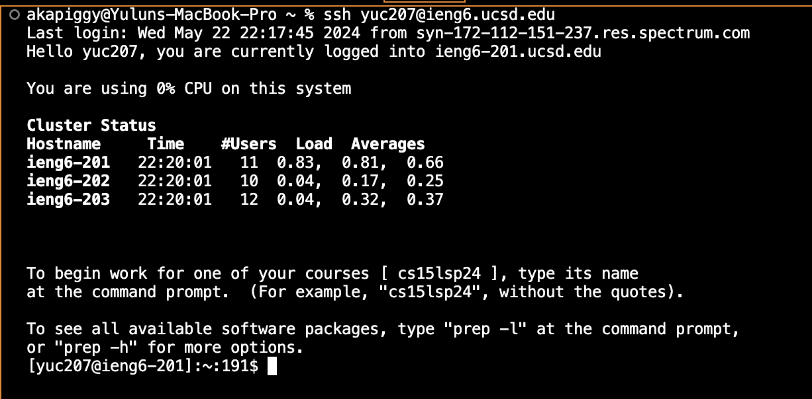
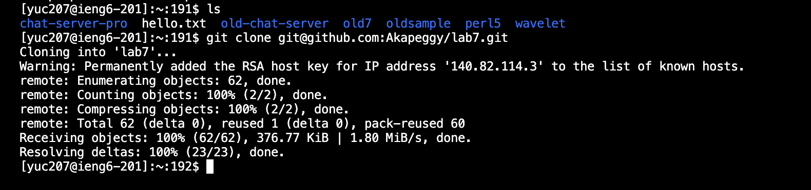
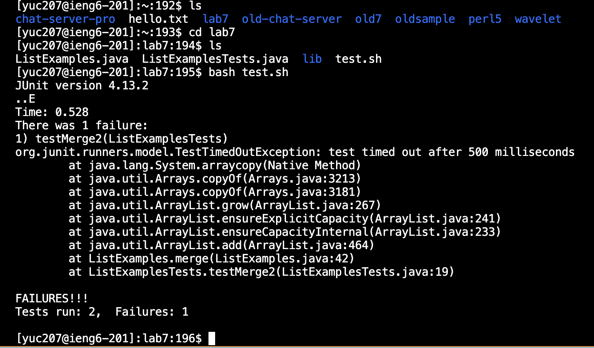
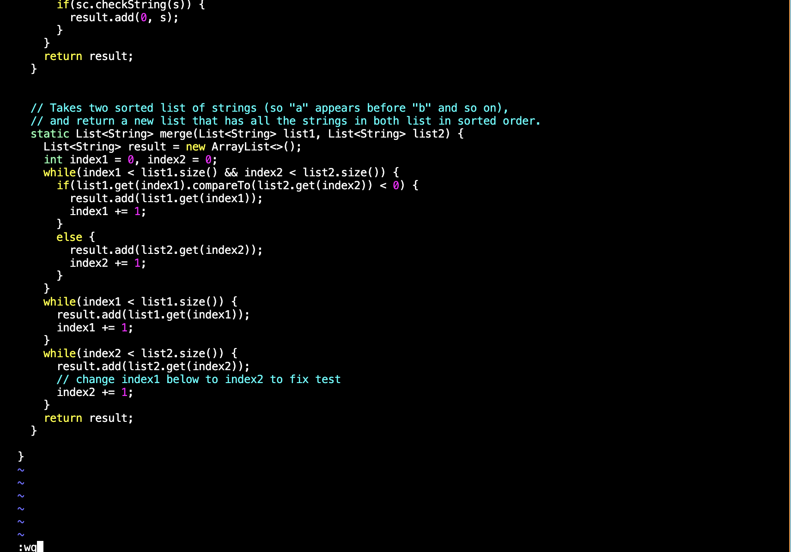
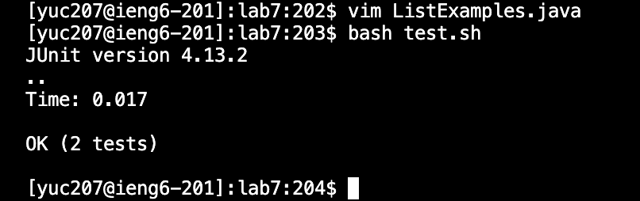
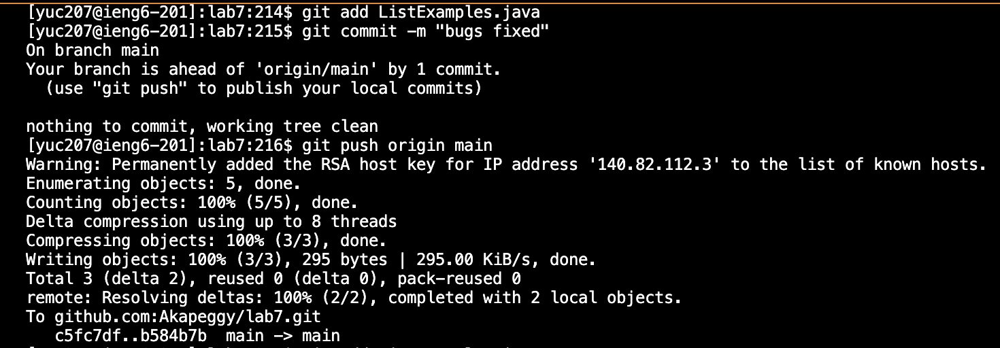

# **Lab 4 Report**
---
  * **Step 4: Log into ieng6**
    
    * Keys pressed: `ssh<space>yuc207@ieng6.ucsd.edu<enter>`
      After opening a new terminal, I typed `ssh yuc207@ieng6.ucsd.edu` to access the `ieng6` remote server. The output followed shows that I logged in successfully.
---
  * **Step 5: Clone your fork of the repository from your GitHub account (using the SSH URL)**
    
    * keys pressed: `ls<enter>`, `git<space>clone<space><command><v><enter>`
      I first typed `ls` then `<enter>` to check the files and directories under my current working directory such that there's no directory has the same name of the one I'm cloning into.
      Then I go to the github page that I fork the repo and copy the link of via ssh. Then I typed `git<space>clone<space><command><v><enter>` to paste the link after the `git clone` command and process the cloning.
      The output followed shows that I cloned the forked repo successfully. 
---
  * **Step 6: Run the tests, demonstrating that they fail**
    
    * Keys pressed: `ls<enter>`, `cd<space>lab7<enter>`, `ls<enter>`, `bash<space>test.sh<enter>`
      First, I typed `ls<enter>` to double check that the forked `lab7` has been successfully cloned under my current working directory.
      Then, I typed `cd<space>lab7<enter>` to change my working directory to `lab7`. After that, I typed `ls<enter>` again to check the files and subdirectories under my current working directory `lab7`.
      Upon observing the test script file `test.sh`, I then typed `bash<space>test.sh<enter>` to start the test.
      The output followed shows that one of the two tests ran failed.
  * **Step 7: Edit the code file to fix the failing test**
    
    * Keys pressed: `vim<space><command><v><enter>`, `43j`, `e`, `r2`, `<shift+;>wq<enter>`
      To fix the bug, I used the vim command to access the pasted file name by typing `vim<space><command><v><enter>`.
      After accessing to the vim interface, I first typed `43j` to move the cursor down to the 43 line. I then typed `e` to jump forwards to the end of the word `index1`, and the cursor is on `1` now.
      Then I typed `r2` to replace the single character `1` to `2`. Finally, I typed `<shift+;>wq<enter>` to save the changes and quit the vim interface.
---
  * **Step 8: Run the tests, demonstrating that they now succeed**
    
    * Keys pressed: <up><up><enter>
      I typed double `up` and then `enter` to run the test again since the command `bash test.sh` is 2 up away. The output followed shows that all tests passed this time, which means I successfully fixed the bug.
---
  * **Step 9: Commit and push the resulting change to your GitHub account**
    
    * Keys pressed: `git<space>add<space><command><v>`, `git<space>commit<space><->m<shift+">bugs<space>fixed<shift+">`, `git<space>push<space>origin<space>main`
      In order to commit the updated file, I typed `git<space>add<space><command><v>` to add the fixed file to the track by using the command `git add` along with pasting the name of the file. Then I typed `git<space>commit<space><->m<shift+">bugs<space>fixed<shift+">` to commit my changes with the comment `bugs fixed`.
      Then, I typed `git push origin main` to push the commit to my GitHub main branch so that all the changes will be shown within my original forked repo. The output followed shows that I successfully commited and pushed all the changes to the original forked repo.
    
