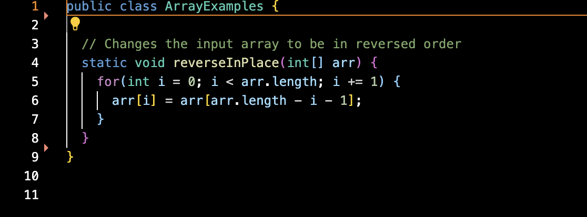
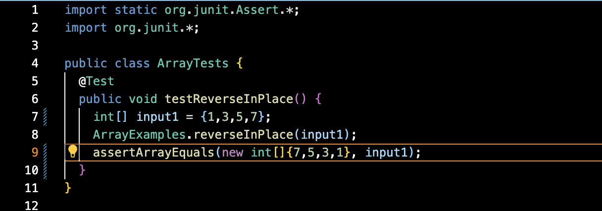
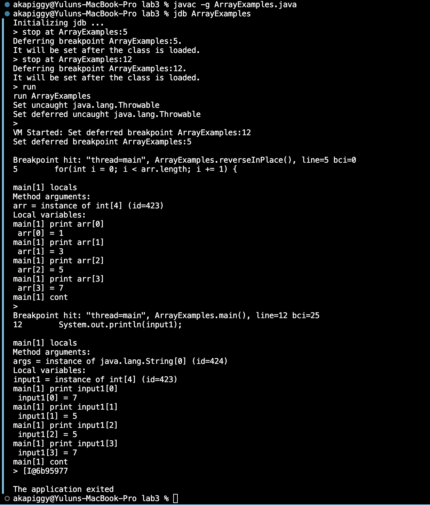
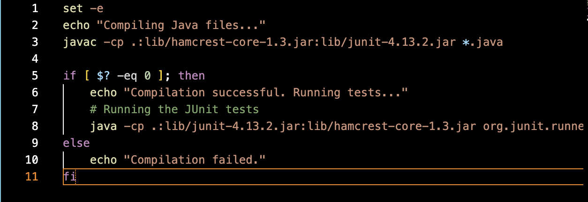
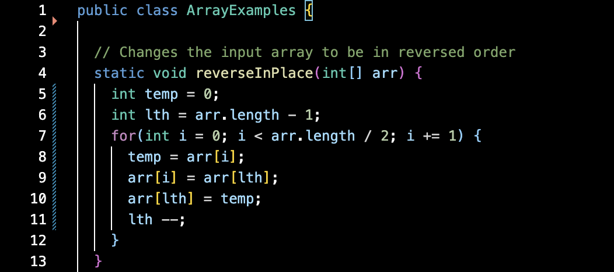
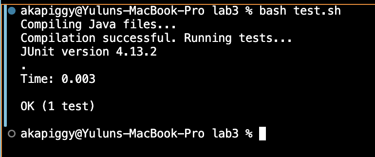

# **Lab 5 Report**
* ## **Part 1**
  1. The original post from a student with a screenshot showing a symptom and a description of a guess at the bug/some sense of what the failure-inducing input is.
     ```
     Title: Question on having trouble with method `reverseInPlace` in ArrayExamples.java

     Hi,
     I'm having an issue that my test failed on the method `reverseInPlace` in ArrayExamples.java. I tried to run tests on this method to reverse my array '{1,3,5,7}'. However, the test failed. and the method doesn't seem to
     run properly. The symptom shows the output array element does not match the expected one in the correct order. I guess it may be due to the wrong implementation of the for loop. I'm attaching the screenshot of the 'reverseInPlace' method
     , my test file, and the symptom below. Please help me out with what causes the error here. I appreaciate it!
     ```
     ArrayExamples.java :
     

     ArrayTests.java :
     

     Symptom:
     
     
  2. A response from a TA asking a leading question or suggesting a command to try.
     ```
     Hi,

     It looks like there could be an issue within your for loop in your method reverseInPlace(int[] arr).
     Could you add debug prints inside the loop to show the value of arr[i] and
     arr[arr.length - i - 1] before and after the swap at each iteration? This could help us
     see better what's behind the scene during each step of the swapping process.
     ```

  3. Another screenshot/terminal output showing what information the student got from trying that, and a clear description of what the bug is.
     
     Description of the bug:   
     I create the main function inside my ArrayExamples.java with the same data elements of the array as in the test file,
     and then use the java debugger to run the class `ArrayExamples` to see what is the actual output, which is shown above.
     Based on the output I have, I consider the bug to be the case that the elements of the array was not swapped correctly.
  4. At the end, all the information needed about the setup including:
     * My buggy file before fixing the bugs:
         
     * My test file:
         
     * my script file:
         
     * The file & directory structure needed:
         ```
         -lab3   
           -lib/
               -hamcrest-core-1.3.jar   
               -junit-4.13.2.jar   
           -ArrayExamples.java   
           -ArrayTests.java   
           -test.sh
         ``` 
     * The full command line (or lines) you ran to trigger the bug
         
     * My buggy file after fixing the bugs:
         
     * Test passed successfully after fixing the bugs:
         
     * A description of what to edit to fix the bug:   
       Optimizing the for loop to only iterate the first half indexes of the array. Using a temporary local variable to hold the value being swapped between the original `arr[i]` and `arr[arr.length - i - 1]`.
       The fixed code is shown in the above subsection 'My buggy file after fixing the bugs:' 
 
* ## **Part 2**
    
    During the second half of this quarter, I’ve learned the Vim keybindings and commands for my code editor. Vim enables rapid editing tasks without relying on a mouse, 
    which streamlines my workflow. Additionally, its suitability for remote or SSH environments, where graphical editors might not be practical,
    is a significant advantage. Furthermore, mastering Vim has deepened my understanding of text editing and command-line interfaces,
    and this skills are crucial in many IT and development roles.
    I’ve also learned that jdb is a critical feature when diagnosing issues in distributed applications or server-based scenarios, which really helped remote debugging.
    Additionally, its ability to set breakpoints and watchpoints simplifies the process of tracking code flow and examining stack tracks, making it easier to pinpoint and resolve issues.
